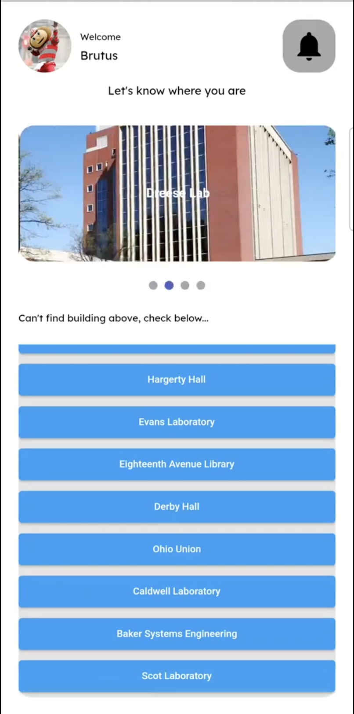

# Indoor Navigation System

This project is an Indoor Navigation System that uses image recognition and pathfinding algorithms to determine the shortest path between two points in a building. The backend is implemented in Python using Flask and Tensorflow, and the frontend is implemented in Dart using Flutter.

Currently, the project is configured for the 3rd floor of [Bolz Hall](https://www.osu.edu/map/building/146) at the Ohio State University. However, it can be configured to add other floors or buildings.

<!-- ## Demonstration Video

[](https://drive.google.com/file/d/1UoUfOGXcpwIAxad-Ibmt2-q5WqtvLG2z/view?usp=sharing) -->

## Demonstration Video

<a href="https://drive.google.com/file/d/1UoUfOGXcpwIAxad-Ibmt2-q5WqtvLG2z/view?usp=sharing">
    
</a>

## Getting Started

These instructions will get you a copy of the project up and running on your local machine for development and testing purposes.

### Prerequisites

You need to have the following installed:

- Python 3.10 or lower
- Flutter SDK
- An IDE (like VS Code or Android Studio)

### Backend Setup

1. Clone the repo
   ```
   git clone https://github.com/Adewale-1/IndoorNav.git
   ```
2. Navigate to the backend directory
   ```
   cd Backend
   ```
3. Create a virtual environment (optional: use Anaconda)
   ```
   python3 -m venv env
   source env/bin/activate
   ```
4. Install the requirements
   ```
   pip install -r requirements.txt
   ```
5. Run the Flask API
   ```
   python app.py
   ```

### Frontend Setup

1. Navigate to the frontend directory
   ```
   cd indoornav
   ```
2. Update the `ipAddress` variable in the `CameraScreen.dart` file to the IP address of your Flask API
3. Get Flutter packages
   ```
   flutter pub get
   ```
4. Run the Flutter app
   ```
   flutter run
   ```

### Running Backend and Frontend on the Same Machine

If you are running the backend and frontend on the same machine, you need to set the `ipAddress` variable in the `CameraScreen.dart` file to your local IP address. Here are the steps:

1. Find your local IP address. The steps to do this vary depending on your operating system:

   - On Windows, open the Command Prompt and type `ipconfig`. Your local IP address is listed next to `IPv4 Address`.
   - On Mac, open System Preferences, click on Network, and your IP address will be displayed.
   - On Linux, open the Terminal and type `hostname -I`.

2. Open the `CameraScreen.dart` file in your IDE.

3. Find the `ipAddress` variable and set it to your local IP address. Make sure to include the port number (`:8080`) at the end. It should look like this:

   ```dart
   String ipAddress = 'http://your.local.ip.address:8080';
   ```

4. Save the `CameraScreen.dart` file and restart to add the new build to your device.

5. Run the Flask API (backend) as described in the Backend Setup section above.

6. Run the Flutter app (frontend) as described in the Frontend Setup section above.

Now, the Flutter app will send requests to the Flask API running on your local machine. The path image returned from the API will be displayed in the Flutter app.

### If you are running the backend and frontend on different machines, you will see a message in your terminal when you run the Flask API:

```
Serving Flask app 'app'
Debug mode: off
Running on all address (0.0.0.0)
Running on http://local.ip.address:8080
```

In this case, you should set the `ipAddress` variable in the `CameraScreen.dart` file to `http://local.ip.address:8080`.

## Usage

The application works by taking a picture of a room number (the starting point) and a destination room number is inputted. The picture and the room number are sent to the Flask API for image analysis and pathfinding. The API returns an image showing the shortest path from the starting point to the destination.

## Files

Here is a brief explanation of the key files in the project:

- `app.py`: This is the main file that runs the Flask API. It receives the image and room number from the frontend, performs image analysis to extract the starting point, and uses a pathfinding algorithm to find the shortest path to the destination.

- `CameraScreen.dart`: This is the Flutter screen where the user can take a picture and input a destination room number. The picture and room number are sent to the Flask API.

- `MapScreen.dart`: This is the Flutter screen where the path image returned from the Flask API is displayed.

- `image_analysis.py`: This file contains functions for loading an image, checking if a pixel is navigable, checking if a pixel position is valid, applying the A\* algorithm to find a path, and drawing the path on the image.

- `image_reader.py`: This file contains functions for extracting text from an image and finding a path in an image.

## Contributing

Contributions are what make the open source community such an amazing place to learn, inspire, and create. Any contributions you make are greatly appreciated.

## License

Distributed under the MIT License. See `LICENSE` for more information.

## Acknowledgments

- Thanks to [Daniel](https://github.com/danield33), Stanley, and Jacob for their significant contributions to this project.
- Also, thanks to the open source community for providing the resources needed to learn and build this project.

Project Link: [https://github.com/Adewale-1/IndoorNav](https://github.com/your_username/repo_name)
